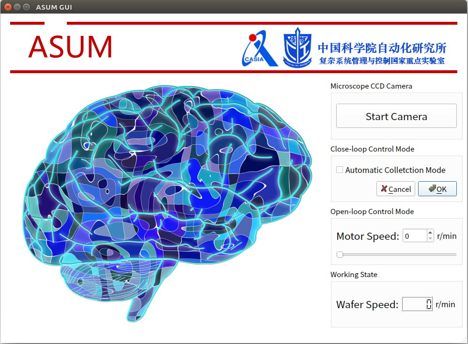

# Automated Silicon-substrate Ultra-microtome (ASUM) 
The repo includes comprehensive open source files of ASUM
- Mechanical design drawings of ASUM
- Detection and control code and for ASUM 
- GUI for ASUM

----

## Mechanical design drawings of ASUM
<!--  -->

----

## Detection and control code and for ASUM (Include GUI)

### GUI of ASUM

----

## Acknowledgements
