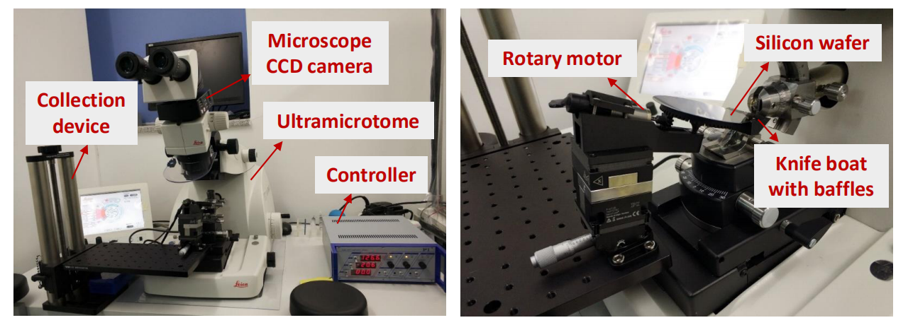
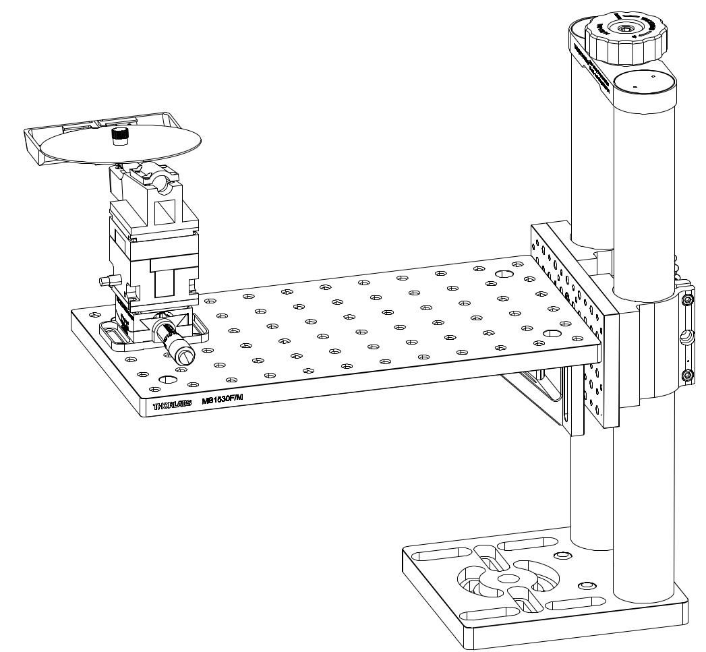
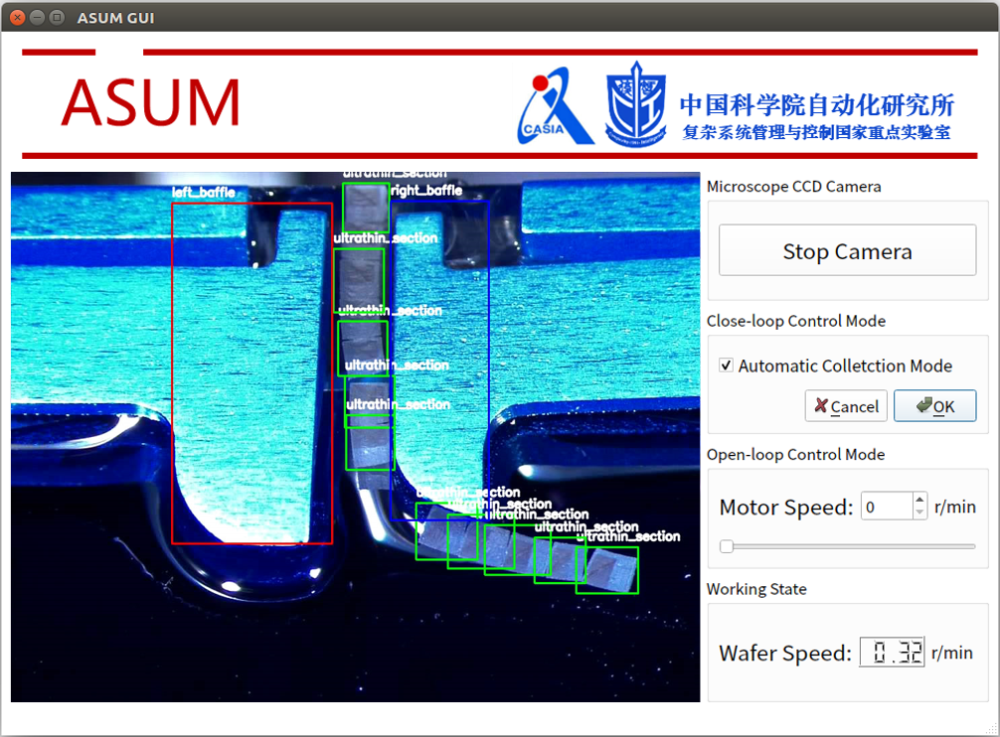

# Automated Silicon-substrate Ultra-microtome (ASUM) 
ASUM is a novel mechanism based on circular silicon substrates for automatic collection of brain sections



This repository contains the comprehensive release files of the ASUM:
- Mechanical design drawings of the ASUM
- Detection and control code of the ASUM 
- GUI of the ASUM

----

## Mechanical design drawings of the ASUM
<!--  -->


- Open the design drawings by [UG](https://www.plm.automation.siemens.com/global/en/products/nx/) or [Solidworks](https://www.solidworks.com/zh-hans)
```
./Mechanical_drawing/Assembly_source_files-overall/装配体2(1).stp
```


----

## Detection and control code of the ASUM (Include GUI)


**Note**: In this section, we assume that you are always in the directory $PROJECT_ROOT/

### Compatability
Currently this repo is compatible with Python 3, Pytorch 0.40, PyQt5.

### Running tutorial
- Download Pre-trained Model
  - Download address: [Pre-trained SSD detection model for brain sections](https://drive.google.com/file/d/1bxM01SwDm1i7HxVM0AG3kzNZ3eUrKP-M/view?usp=sharing)
  - Put the pre-trained model as `./Detection_and_control/ASUM-GUI-with-detection-and-control/models/SSD_sections_det.pth`

- Make sure the ASUM is installed successfully on the Ultra-microtome, and make sure the serial port communication authority of the host is provided


- Run GUI
```
python3 ./Detection_and_control/ASUM-GUI-with-detection-and-control/main-asum-gui-final.py
```

----
## Declare
The Mechanical design drawings, GUI and the automatic control system of the ASUM can be used only for the purpose of academic study

## Citation
To be update, the paper has been accepted by IEEE/CAA Journal of Automatica Sinica (JAS).

